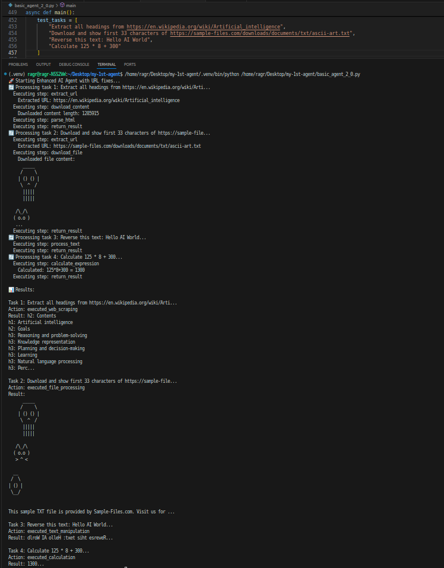

# 🤖 Enhanced AI Agent System

A sophisticated AI Agent framework that combines LLM capabilities with tool-based execution for complex task automation.



## 🚀 Features

- **🛠️ Tool System**: Web scraping, file processing, text manipulation, calculations
- **🧠 Smart Planning**: Automatic task analysis and workflow creation
- **💾 Memory System**: Caching and recall of similar tasks
- **🔄 Adaptive Processing**: Chooses between direct LLM vs tool-based execution
- **⚡ Error Handling**: Robust error recovery and logging

## 📦 Installation

### Prerequisites

- Python 3.8+
- OpenRouter API account

### Setup

1. **Clone and install dependencies:**

```bash
pip install -r requirments.txt
```

2. **Environment Configuration:**
Create a `.env` file:

```env
api-key=your_openrouter_api_key_here
LLM-model=your_preferred_model
```

## 🎯 Quick Start

### Basic Usage

```python
from enhanced_agent import run_enhanced_agent
import asyncio

async def main():
    tasks = [
        "Reverse this text: hello world",
        "Calculate 45 * 12 + 8",
        "Download content from https://example.com",
    ]
    
    results = await run_enhanced_agent(tasks)
    print(results)

asyncio.run(main())
```

### Advanced Usage

```python
from enhanced_agent import EnhancedAIAgent

async def custom_agent():
    agent = EnhancedAIAgent(api_key="your_key", model="your_model")
    
    # Process complex tasks
    result = await agent.process_task(
        "Find all laptop prices from https://divar-contest.darkube.app/divar_sample.html and sum them"
    )
    print(result)
```

## 🔧 Available Tools

| Tool | Description | Usage Example |
|------|-------------|---------------|
| `web_downloader` | Download web content | "Get content from <https://example.com>" |
| `file_downloader` | Download files | "Download file from URL" |
| `text_processor` | Text manipulation | "Reverse this sentence" |
| `calculator` | Mathematical operations | "Calculate 125 * 8" |
| `url_extractor` | Extract URLs from text | Auto-used when URLs detected |

## 🏗️ Architecture

```
User Task
    ↓
Task Analyzer (AgentBrain)
    ↓
Workflow Planner (TaskPlanner) 
    ↓
Tool Executor (TaskExecutor)
    ↓
Result Formatter
    ↓
Final Output
```

### Core Components

1. **AgentBrain**: Analyzes tasks and determines required tools
2. **TaskPlanner**: Creates execution workflows
3. **TaskExecutor**: Orchestrates tool execution
4. **ToolRegistry**: Manages available tools
5. **AgentMemory**: Caches results and learns patterns

## 📝 Usage Examples

### Example 1: Text Processing

```python
task = "Reverse this text: Hello AI World"
result = await agent.process_task(task)
# Returns: "World AI Hello"
```

### Example 2: Web Scraping

```python
task = "Extract headings from https://example.com"
result = await agent.process_task(task)
# Returns list of headings
```

### Example 3: Calculations

```python
task = "What is 3*5 + 2//3?"
result = await agent.process_task(task)
# Returns: "15"
```

### Example 4: Complex Workflow

```python
task = "Download https://divar-contest.darkube.app/data.txt and sum all numbers"
# Agent automatically: Extracts URL → Downloads → Parses → Calculates → Returns sum
```

## 🎪 Hackathon Integration

### For CTF Challenges

```python
ctf_tasks = [
    "do what image says at { https://divar-contest.darkube.app/fyvkr93-public.png }",
    "find the first laptop in https://divar-contest.darkube.app/divar_sample.html",
    "calculate 3*5 + 2 // 3",
    ".tfel nruter tsuj t'nod tub rewsna eht sa \"tfel\" drow eht fo etisoppo eht etirw"
]

results = await run_enhanced_agent(ctf_tasks)
```

## ⚙️ Configuration

### Environment Variables

- `api-key`: Your OpenRouter API key
- `LLM-model`: Model name (e.g., "anthropic/claude-3-sonnet")

### Model Settings

- Temperature: 0.1 (for consistent outputs)
- Max Tokens: 512
- Timeout: 30 seconds

## 🔍 Error Handling

The system includes comprehensive error handling:

- Tool execution failures
- Network timeouts
- Invalid responses
- Memory cache misses

## 🚨 Limitations

- Requires OpenRouter API access
- Limited to available tools
- Async operations required
- Web scraping depends on target site permissions

## 🤝 Contributing

### Adding New Tools

```python
def my_custom_tool(**kwargs):
    # Tool implementation
    return result

# Register tool
agent.tools.register_tool(
    name="my_tool",
    function=my_custom_tool,
    description="What my tool does"
)
```

## 🆘 Support

For issues and questions:

1. Check your API key and model settings
2. Verify internet connectivity for web tools
3. Ensure all dependencies are installed
